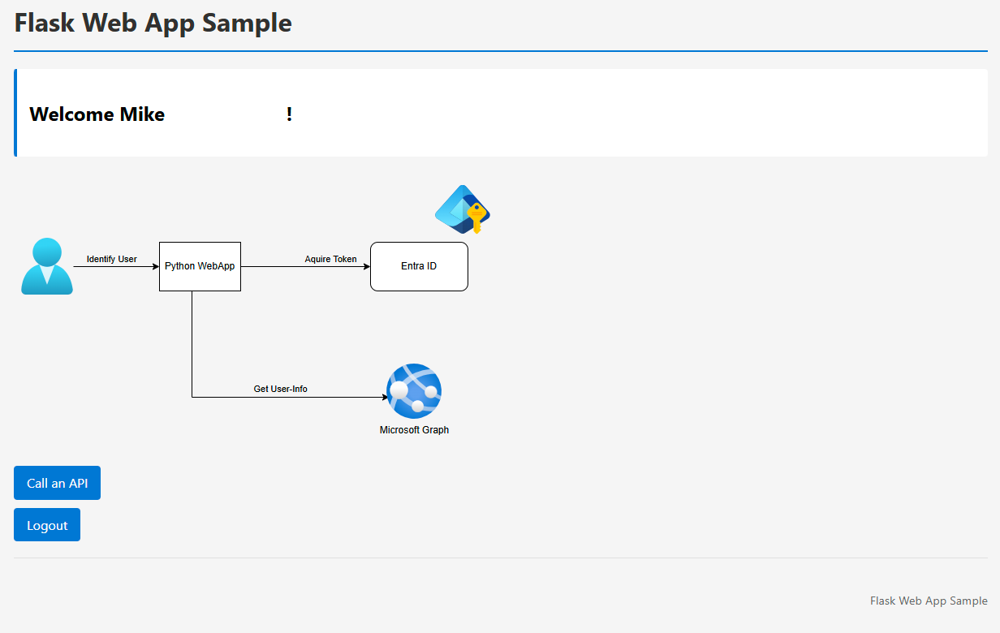

## Using the Microsoft MSAL library to authenticate users against Entra ID 
This demo is based on source code from [Mike in the Cloud](https://www.youtube.com/watch?v=zMorhe5uXno)

### Setup a virtual python environment: 
> python -m venv .venv  
> .venv\scripts\activate  
> pip install -r requirements.txt  

## App service in azure running on Python 3.13

Make a .env file in the root with these vars in it

> CLIENT_ID="<Enter_your_client_id>"  
> CLIENT_SECRET="<Enter_your_client_secret>"  
> AUTHORITY="https://login.microsoftonline.com/<Enter_tenant_id>"  
> REDIRECT_URI="http://localhost:3000/getAToken"  
> SCOPE=User.Read  
> ENDPOINT=https://graph.microsoft.com/v1.0/me  
> AUTH_ENABLED=True

Make sure to add the redirect URL to your enterprise APP!!

### Run the instance locally with:
>python -m flask run --debug --host=localhost --port=3000  
